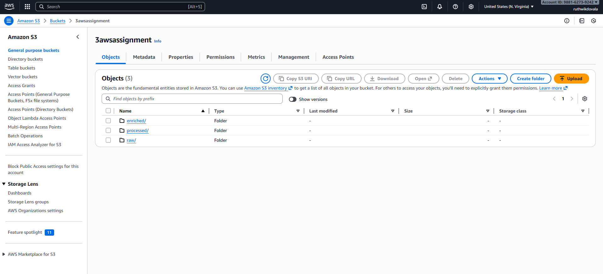
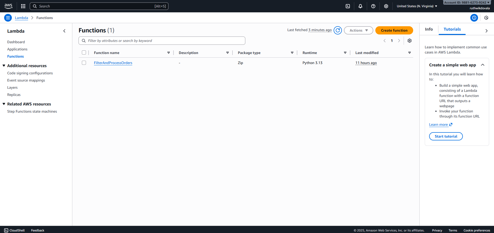
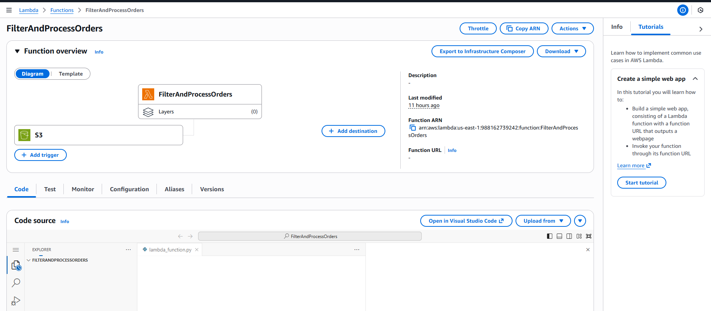
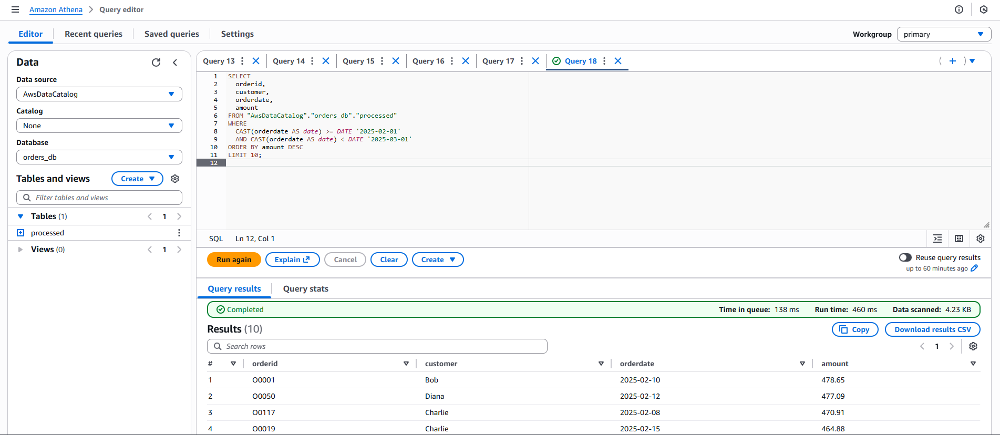
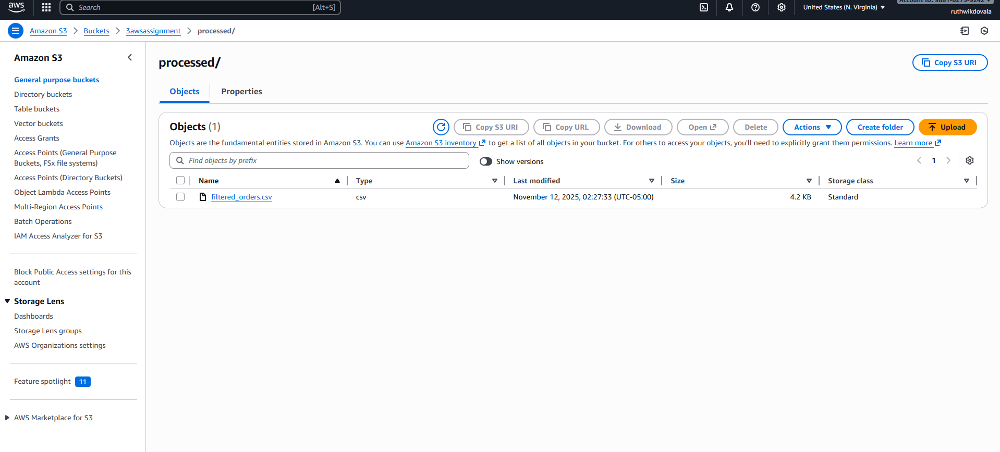
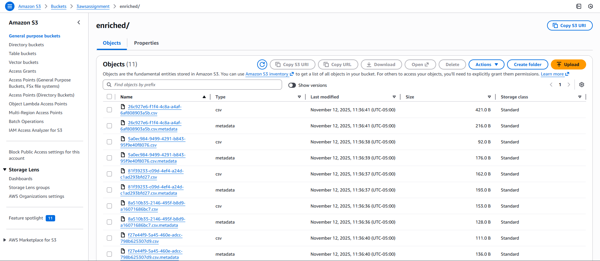
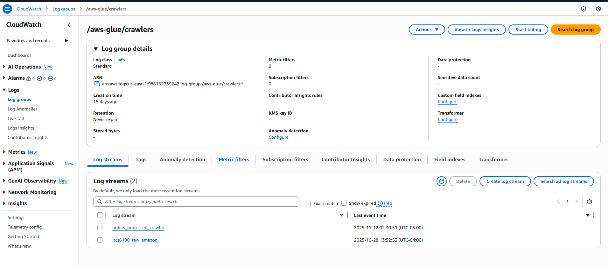
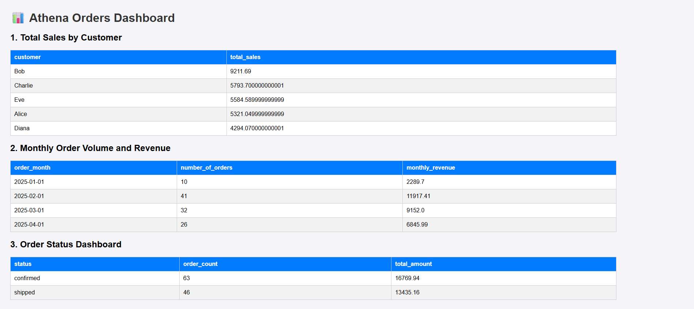
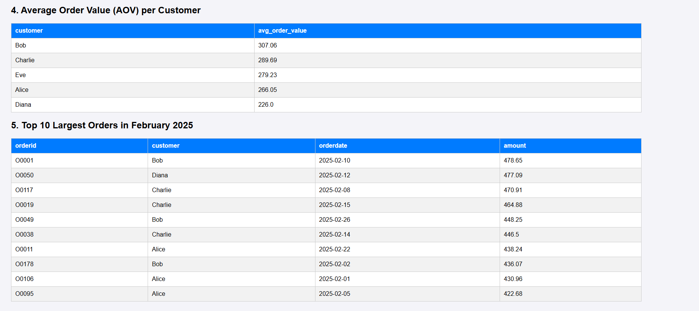

# ITCS-6190 Assignment 3: AWS Data Processing Pipeline

This project demonstrates an end-to-end serverless data processing pipeline on AWS. The process involves ingesting raw data into S3, using a Lambda function to process it, cataloging the data with AWS Glue, and finally, querying and visualizing the results on a dynamic webpage hosted on an EC2 instance.

## 1. Amazon S3 Bucket Structure 🪣

First, set up an S3 bucket with the following folder structure to manage the data workflow:

* **`bucket-name/`**
    * **`raw/`**: For incoming raw data files.
    * **`processed/`**: For cleaned and filtered data output by the Lambda function.
    * **`enriched/`**: For storing athena query results.
---

## 2. IAM Roles and Permissions 🔐

Create the following IAM roles to grant AWS services the necessary permissions to interact with each other securely.

### Lambda Execution Role

1.  Navigate to **IAM** -> **Roles** and click **Create role**.
2.  **Trusted entity type**: Select **AWS service**.
3.  **Use case**: Select **Lambda**.
4.  **Add Permissions**: Attach the following managed policies:
    * `AWSLambdaBasicExecutionRole`
    * `AmazonS3FullAccess`
5.  Give the role a descriptive name (`Lambda-S3-Processing-Role`) and create it.

### Glue Service Role

1.  Create another IAM role for **AWS service** with the use case **Glue**.
2.  **Add Permissions**: Attach the following policies:
    * `AmazonS3FullAccess`
    * `AWSGlueConsoleFullAccess`
    * `AWSGlueServiceRole`
3.  Name the role (`Glue-S3-Crawler-Role`) and create it.

### EC2 Instance Profile

1.  Create a final IAM role for **AWS service** with the use case **EC2**.
2.  **Add Permissions**: Attach the following policies:
    * `AmazonS3FullAccess`
    * `AmazonAthenaFullAccess`
3.  Name the role (`EC2-Athena-Dashboard-Role`) and create it.

---

## 3. Create the Lambda Function ⚙️

This function will automatically process files uploaded to the `raw/` S3 folder.

1.  Navigate to the **Lambda** service in the AWS Console.
2.  Click **Create function**.
3.  Select **Author from scratch**.
4.  **Function name**: `FilterAndProcessOrders`
5.  **Runtime**: Select **Python 3.9** (or a newer version).
6.  **Permissions**: Expand *Change default execution role*, select **Use an existing role**, and choose the **Lambda Execution Role** you created.
7.  Click **Create function**.
8.  In the **Code source** editor, replace the default code with LambdaFunction.py code for processing the raw data.

---

## 4. Configure the S3 Trigger ⚡

Set up the S3 trigger to invoke your Lambda function automatically.

1.  In the Lambda function overview, click **+ Add trigger**.
2.  **Source**: Choose **S3**.
3.  **Bucket**: Select your S3 bucket.
4.  **Event types**: Choose **All object create events**.
5.  **Prefix (Required)**: Enter `raw/`. This ensures the function only triggers for files in this folder.
6.  **Suffix (Recommended)**: Enter `.csv`.
7.  Check the acknowledgment box and click **Add**.

--- 
**Start Processing of Raw Data**: Now upload the Orders.csv file into the `raw/` folder of the S3 Bucket. This will automatically trigger the Lambda function.
---

## 5. Create a Glue Crawler 🕸️

The crawler will scan your processed data and create a data catalog, making it queryable by Athena.

1.  Navigate to the **AWS Glue** service.
2.  In the left pane, select **Crawlers** and click **Create crawler**.
3.  **Name**: `orders_processed_crawler`.
4.  **Data source**: Point the crawler to the `processed/` folder in your S3 bucket.
5.  **IAM Role**: Select the **Glue Service Role** you created earlier.
6.  **Output**: Click **Add database** and create a new database named `orders_db`.
7.  Finish the setup and run the crawler. It will create a new table in your `orders_db` database.

---

## 6. Query Data with Amazon Athena 🔍

Navigate to the **Athena** service. Ensure your data source is set to `AwsDataCatalog` and the database is `orders_db`. You can now run SQL queries on your processed data.

**Queries to be executed:**
* **Total Sales by Customer**: Calculate the total amount spent by each customer.
* **Monthly Order Volume and Revenue**: Aggregate the number of orders and total revenue per month.
* **Order Status Dashboard**: Summarize orders based on their status (`shipped` vs. `confirmed`).
* **Average Order Value (AOV) per Customer**: Find the average amount spent per order for each customer.
* **Top 10 Largest Orders in February 2025**: Retrieve the highest-value orders from a specific month.

---

## 7. Launch the EC2 Web Server 🖥️

This instance will host a simple web page to display the Athena query results.

1.  Navigate to the **EC2** service and click **Launch instance**.
2.  **Name**: `Athena-Dashboard-Server`.
3.  **Application and OS Images**: Select **Amazon Linux 2023 AMI**.
4.  **Instance type**: Choose **t2.micro** (Free tier eligible).
5.  **Key pair (login)**: Create and download a new key pair. **Save the `.pem` file!**
6.  **Network settings**: Click **Edit** and configure the security group:
    * **Rule 1 (SSH)**: Type: `SSH`, Port: `22`, Source: `My IP`.
    * **Rule 2 (Web App)**: Click **Add security group rule**.
        * Type: `Custom TCP`
        * Port Range: `5000`
        * Source: `Anywhere` (`0.0.0.0/0`)
7.  **Advanced details**: Scroll down and for **IAM instance profile**, select the **EC2 Instance Profile** you created.
8.  Click **Launch instance**.

---

## 8. Connect to Your EC2 Instance


Instance name: `Athena-Dashboard-Server`

AMI: `Amazon Linux 2023`

Instance type: `t2.micro`

Security group: Inbound SSH (port 22, My IP) + Custom TCP (port 5000, 0.0.0.0/0)

IAM instance profile: `EC2-Athena-Dashboard-Role`

Install `Python3`, `Flask`, `Boto3`, and deploy `app.py`

Run `python3 app.py`, open the public link.


## 9. Run the App and View Your Dashboard! 🚀

1.  Execute the Python script to start the web server:
    ```bash
    python3 app.py
    ```
    It contains all the query codes in it.
    
    You should see a message like `* Running on http://0.0.0.0:5000/`.

2.  Open a web browser and navigate to your instance's public IP address on port 5000:
    ```
    http://YOUR_PUBLIC_IP_ADDRESS:5000
    ```
    You should now see your Athena Orders Dashboard!

---

## Important Final Notes

* **Stopping the Server**: To stop the Flask application, return to your SSH terminal and press `Ctrl + C`.
* **Cost Management**: This setup uses free-tier services. To prevent unexpected charges, **stop or terminate your EC2 instance** from the AWS console when you are finished.


## SCREEN SHOTS

S3 BUCKET


IAM ROLES


LAMBDA


TRIGGER


QUERY


CSV PROCESSED


ENRICHED CSV


CLOUDWATCH


DASHBOARD




-- BY RUTHWIK DOVALA (801431661)
